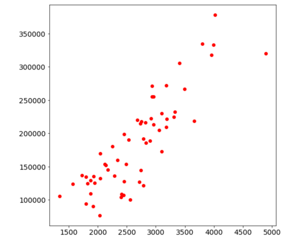
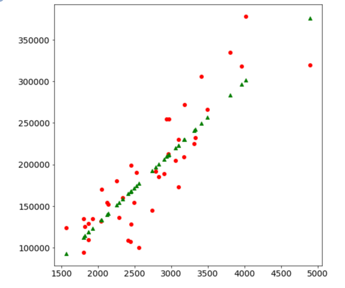
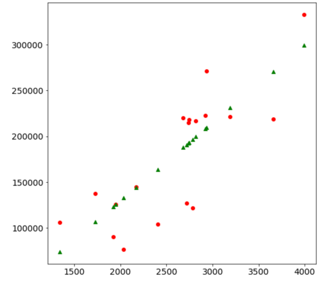

#### студент - Лісничий Сергій
#### група - ЗПІ-зп01
### Програмування інтелектуальних інформаційних систем

 Прогнозування ціни будинку в залежності від параметрів(розмір його площі) з використання тренування, верифікації нейромережі.
 
**результат роботи:** https://colab.research.google.com/gist/slisnychyi/0e946085e34627d15e8bae872e34b439/neuronetwork.ipynb

для роботи використано: **Google CoLabaratory** 

Робота складається з наступних **етапів**:
1. **Підготовка даних.**

- Ми будемо використовувати датасет - Ames dataset, що є стандартним датасетом використовуваним для прогнозування ціни будинку в залежності від його характеристик.
Була скачана частина даних за один місяць. 05-2010.csv
- Завантажити дані в **pandas** dataframe для аналізу
- Використаємо бібліотеку **matplotlib** для того, щоб візуалізувати наші дані. Щоб дати нам відображеня відношення ціни до розміру будинку.

  Ми бачимо лінійну залежність між ціною та розміром. y = mx + b Price = m * square fet + b
2. **Створюємо модель**
- Для створення моделі нейромережі, будемо використовувати високорівненву бібліотеку **Keras**. Нейромережа складається з нейронів. Створюємо такий нейрон.
3. **Компілюємо модель**
- Після створення моделі нам необхідно її підготувати для тренування.
Тренування моделі відбувається шляхом передачі тренувальних даних і змінюючи weight та bias, щоб зменшити loss (error).
Щоб цього досягти нам потрібний метод, який оцінює loss та оптимізує weight та bias, щоб зменшити loss.
y = wx + b
Ми будемо використовувати **Mean-Squared Error** для оцінки loss та **Stochastic Gradient Descent** ('sdg'), щоб знайти оптимальні показники weight та bias, щоб зменшити loss.
4. **Тренуємо модель**
- Тренуємо модель використовуючи розподілені дані.
Ми передаємо дані в модель декілька разів, на кожному разі loss ф-ія (яку ми створили на єтапі компілювання) буде використана для розрахунку loss.
І optimizer буде використаний, щоб робити підлаштування weight та bias для мінімізації цього error.
5. **Візуальне відображення тренованої моделі**
- Після тренування наша модель визначила кращі значення для weight та bias. Подивімось як візуально це виглядатиме

6. **Перевірка нашої моделі з тестовими даними**
- Після того як ми отримали коректну натреновану модель, ми хочемо перевірити її якість з тестовими даними.
